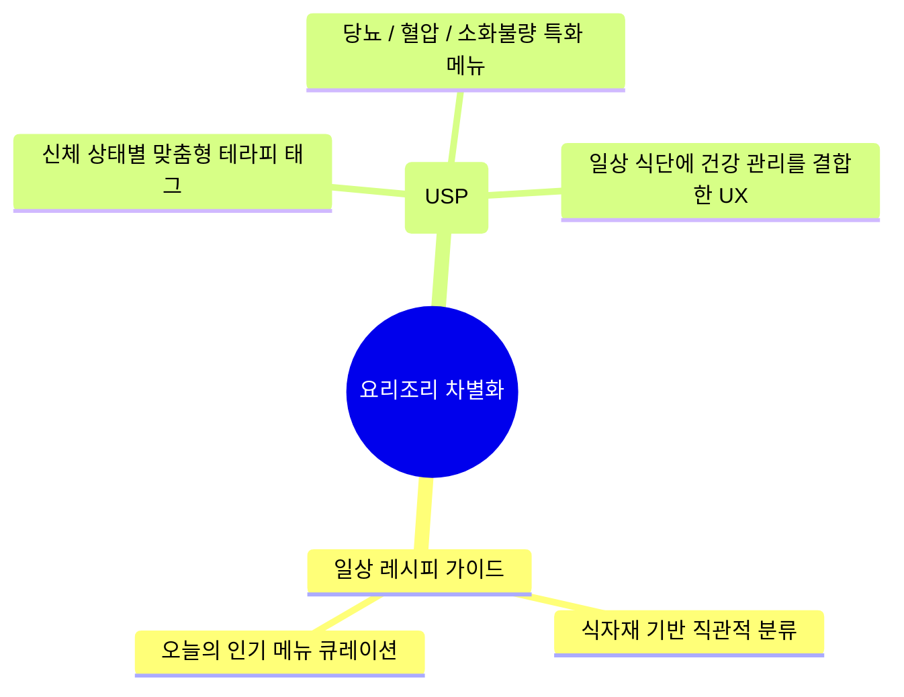
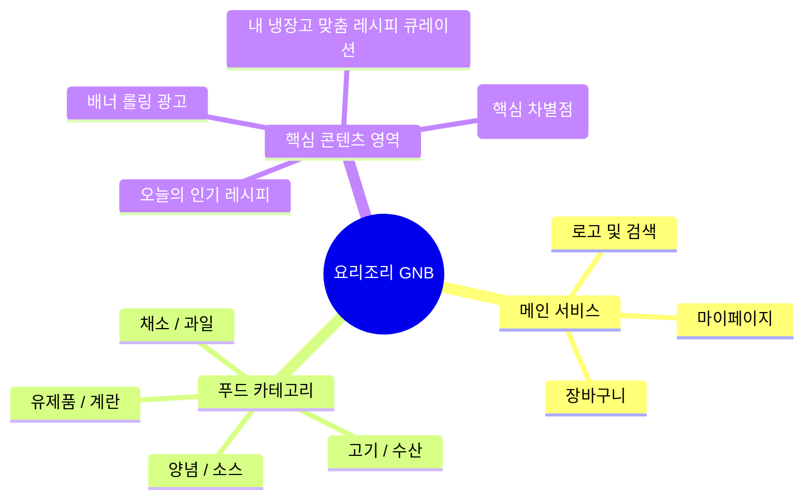

# 🍳 요리조리 (YoriJori) - 맞춤형 레시피 & 테라피 푸드 플랫폼

> 사용자의 일상적인 요리 라이프를 지원하고, 특별한 건강 관리(테라피) 큐레이션을 더해 차별화된 경험을 제공하는 UI/UX 및 웹 디자인 프로젝트입니다.

👉 [실제 배포된 요리조리 웹사이트 보러가기](https://github.io)

---

## 📌 1. 프로젝트 개요

| 구분 | 내용 |
|---|---|
| **서비스명** | 요리조리 (YoriJori) |
| **기본 핵심 기능** | 냉장고 속 재료 매칭, 대중적인 인기 레시피 추천 및 카테고리별 식자재 탐색 |
| **타겟 유저** | 식자재 소비를 고민하는 1인 가구, 일상 요리가 고민인 입문자 및 숙련자 |
| **디자인 강점** | 가독성 높은 격자형 인터페이스, 직관적인 카테고리 아이콘 시스템, 오리지널 요리사 캐릭터 구축 |

---

## 🚀 2. 서비스 핵심 차별화 전략 (USP)

타 서비스와의 확실한 포지셔닝 차별화를 위해 디자인 및 기획 단계에서 반영한 핵심 요소입니다.

---

## ⚙️ 3. UX 디자인 프로세스

비주얼 아이덴티티 수립부터 화면 설계, 최종 인터랙션 검토까지 구조적인 디자인 프로세스를 거쳐 유저 경험을 설계했습니다.

---

## 🧠 4. 정보 구조 및 화면 구성 (IA Map)

유저가 홈 화면에서 원하는 목적(인기 레시피, 테라피 찾기, 냉장고 매칭)에 따라 시선이 자연스럽게 흐르도록 설계한 정보 구조입니다.

---

## 🛠️ 사용 도구 및 리소스

화면 레이아웃 빌드와 독창적인 캐릭터/배너 리소스 제작에 활용된 핵심 도구 라인업입니다.

`Figma` `Photoshop` `Illustrator` `Clip Studio Paint`

---

## 📂 5. 페이지별 주요 설계 포인트

| 영역 | 세부 설계 내용 및 포인트 | 활용 툴 |
|---|---|---|
| **상단 GNB & 카테고리** | 아이콘 중심의 명확한 식자재 분류 UI, 장바구니 및 유저 인덱스 접근성 강화 | Figma, Illustrator |
| **프로모션 롤링 배너** | 정보 전달력을 높인 연속 배너 컴포넌트 및 비주얼 그래픽 디자인 | Photoshop |
| **테라피 레시피 영역 (USP)** | 당뇨·혈압·소화불량 등 신체 상태별 맞춤 태그 디자인 및 검색 차별화 시스템 설계 | Figma |
| **냉장고 맞춤형 추천** | 요리사 오리지널 캐릭터를 활용한 친근한 UX 가이드라인 및 인터페이스 기획 | Clip Studio Paint, Figma |

---

## 📧 Contact

| 구분 | 링크/정보 |
|---|---|
| **Email** | sormadbwls@naver.com |
| **GitHub Repository** | [sormadbwls-ux/cook](https://github.com) |
| **배포 사이트** | [요리조리 웹 사이트 바로가기](https://github.io) |

